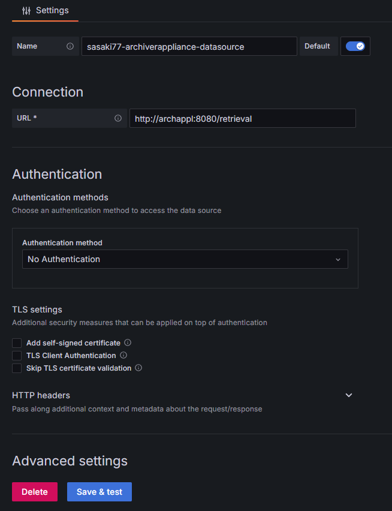

# Configuration
## Add New Archiver Appliance Datasource
After installing plugin you can add Archiver Appliance datasource.

To add Archiver Appliance datasource, follow the below steps.

1. Open `Data Sources` in the side menu.
2. Click `Add data source`.
3. Select `ArchiverAppliacne` in the list.

Please refer [How to add a data source](https://grafana.com/docs/grafana/latest/features/datasources/add-a-data-source/) for
more information.

## Datasource Settings

### HTTP
- **URL:** sets `retrieval url` end with retrieval.
- **Allowed Cookies:** no need to configure.
- **Timeout:** sets HTTP request timeout in seconds if you need.

### Auth
Basically, no need to configure.

### Misc
- **Use Backend:** enables GO backend to retrieve the archive data for visualization. The archived data is retrieved and processed on Grafana server, then the data is sent to Grafana client.
- **Default Operator:** controls the default operator for processing of data during data retrieval.
- **Hide Invalid:** hides the sample data whose severity is invalid with a null value. This feature is only effective if you are using the backend data retrieval.
- **Use live feature:** enables live updating with PVWS WebSocket server.
- **PVWS URI:** sets the URI for the PVWS WebSocket server.
