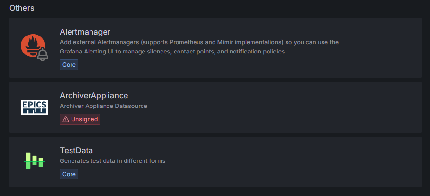

# Configuration
## Add New Archiver Appliance Datasource
After installing plugin you can add Archiver Appliance datasource.

To add Archiver Appliance datasource, follow the below steps.

1. Open `Data Sources` in the side menu.
2. Click `Add data source`.
3. Select `ArchiverAppliacne` in the list.

Please refer [How to add a data source](https://grafana.com/docs/grafana/latest/features/datasources/add-a-data-source/) for
more information.

## Datasource Settings

### HTTP
- **URL:** set `retrieval url` end with retrieval.
- **Access:** controls how requests to the data source will be handled. Only `Server` mode is tested in this plugin.
  - **Server:** Grafana backend/server forwards the requests to the Archiver Appliance server.
  - **Browser:** directly access to the Archiver Appliance server from the browser.
- **Whitelisted Cookies:** no need to configure.

### Auth
Basically, no need to configure.

### Misc
- **Use Backend:** enable GO backend to retrieve the archive data for visualization. The archived data is retrieved and processed on Grafana server, then the data is sent to Grafana client.