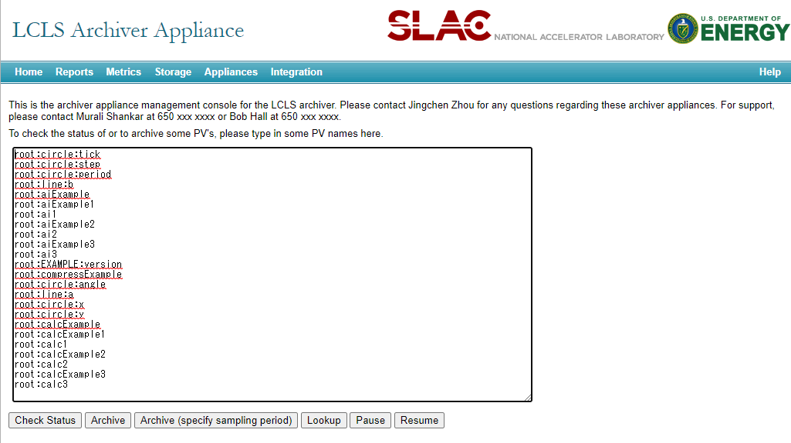

# Development
## Development setup

This data source plugin consists of both frontend and backend components.

### Front-end Development

Node version v12.x is recommended. If you're new to the Node.js ecosystem, [Node Version Manager](https://github.com/nvm-sh/nvm) is a good place to start for managing different Node.js installations and environments. 

[grafana-toolkit](https://github.com/grafana/grafana/tree/master/packages/grafana-toolkit) is used to develop the plugin. Please refer grafana-toolkit documentation for more information.

1. Begin by installing Yarn ([https://yarnpkg.com/](https://yarnpkg.com/))
    ```bash
    npm install -g yarn
    ```

2. Install dependencies
    ```bash
    yarn install
    ```

3. Build plugin in development mode or run in watch mode
    ```bash
    yarn dev
    ```
    or
    ```bash
    yarn watch
    ```

4. Build plugin in production mode
    ```bash
    yarn build
    ```

### Back-end Development

If the Mage build tool is not already installed, you may install it using the installation instructions on the [Mage homepage](https://magefile.org/)

1. Update [Grafana plugin SDK for Go](https://grafana.com/docs/grafana/latest/developers/plugins/backend/grafana-plugin-sdk-for-go/) dependency to the latest minor version:

    ```bash
    go get -u github.com/grafana/grafana-plugin-sdk-go
    ```

2. Build backend plugin binaries for Linux, Windows and Darwin:
    ```bash
    mage -v
    ```

3. List all available Mage targets for additional commands:
    ```bash
    mage -l
    ```

### Test environment with Docker Compose
Thanks to [pklaus / docker-archiver-appliance](https://github.com/pklaus/docker-archiver-appliance) and [pklaus / archiver-appliance-with-example-ioc](https://github.com/pklaus/archiver-appliance-with-example-ioc), the test environment is available with Docker Compose.

```bash
docker-compose up
```

The following containers are runinng after `docker-compse up`.

| Name         | Description                                                          |
| ------------ | -------------------------------------------------------------------- |
| **grafana**  | Runs a Grafana server.                                               |
| **archappl** | Runs a EPICS Archiver Appliance.                                     |
| **redis**    | Runs a datastore for the persistance of the appliance configuration. |
| **example**  | Runs a example EPICS IOC to be archived.                             |

To set up the Archiver Appliance, open [http://localhost:17665/mgmt/ui/index.html](http://localhost:17665/mgmt/ui/index.html). You can add the PVs served by the example IOC on this page.
Enter the following lines in the input field and then clicking the `Archive` button.
the Archive will be start a few minuites later.

```
root:circle:tick
root:circle:step
root:circle:period
root:line:b
root:aiExample
root:aiExample1
root:ai1
root:aiExample2
root:ai2
root:aiExample3
root:ai3
root:EXAMPLE:version
root:compressExample
root:circle:angle
root:line:a
root:circle:x
root:circle:y
root:calcExample
root:calcExample1
root:calc1
root:calcExample2
root:calc2
root:calcExample3
root:calc3
```



To add a data source, open Grafana ([http://localhost:3000](http://localhost:3000)). On the data sources page, add a data source and set URL as `http://archappl:17665/retrieval`.


The following is a example query with this test environment.


## Build documentation
This documentation is build by Sphinx. Follow below steps to build documentation.

```
python -m venv env
source env/bin/activate
pip install sphinx myst-parser sphinx_rtd_theme
make html
```
