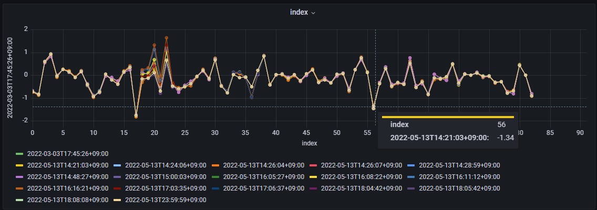

# Functions
## Categories
Functions are categorized into below groups.

- **Transform:** converts the timeseries datapoints from its datapoint values.
- **Array to Scalar:** converts the array data to scalar timeseries data with some method.
- **Filter Series:** picks up some series that meet certain condition.
- **Sort:** sorts the list of timeseries.
- **Options:** adds option parameters.

## Transform Functions

### _scale_
```{eval-rst}
.. function:: scale(factor)
```

Multiplies datapoint by _factor_ at each point.

Examples:

```js
scale(10)
scale(-0.5)
```

### _offset_
```{eval-rst}
.. function:: offset(delta)
```

Adds _delta_ to each datapoint.

Examples:

```js
offset(50)
offset(-0.5)
```

### _delta_
```{eval-rst}
.. function:: delta()
```

Calculates difference between datapoint and its before point at each point.

### _fluctuation_
```{eval-rst}
.. function:: fluctuation()
```

Subtracts first datapoint value from each datapoint.

### _movingAverage_
```{eval-rst}
.. function:: movingAverage(windowSize)
```

Calculates the moving average of datapoints over a fixed number of past points, specified by windowSize param.

Examples:

```js
movingAverage(10)
movingAverage(50)
```

## Array to Scalar Functions

### _toScalarByAvg_
```{eval-rst}
.. function:: toScalarByAvg()
```

Converts the array data to the scalar data with the average value.

### _toScalarByMax_
```{eval-rst}
.. function:: toScalarByMax()
```

Converts the array data to the scalar data with the maximum value.

### _toScalarByMin_
```{eval-rst}
.. function:: toScalarByMin()
```

Converts the array data to the scalar data with the minimum value.

### _toScalarBySum_
```{eval-rst}
.. function:: toScalarBySum()
```

Converts the array data to the scalar data with the total value.

### _toScalarByMed_
```{eval-rst}
.. function:: toScalarByMed()
```

Converts the array data to the scalar data with the median value.

### _toScalarByStd_
```{eval-rst}
.. function:: toScalarByStd()
```

Converts the array data to the scalar data with the standard deviation value.

## Filter Series Functions

### _top_
```{eval-rst}
.. function:: top(number, value)
```

Returns top N series sorted by _value_.
Available _value_ is as following: _avg_, _min_, _max_, _absoluteMin_, _absoluteMax_, and _sum_.

Examples:

```js
top(5, max)
top(10, avg)
```

### _bottom_
```{eval-rst}
.. function:: bottom(number, value)
```

Returns bottom N series sorted by _value_.
Available _value_ is as following: _avg_, _min_, _max_, _absoluteMin_, _absoluteMax_, and _sum_.

Examples:

```js
bottom(5, avg)
bottom(10, min)
```

### _exclude_
```{eval-rst}
.. function:: exclude(pattern)
```

Exclude PV data that match the regular expression.

Examples:

```js
exclude(PV[0-9])
```

## Sort Functions
### _sortByAvg_
```{eval-rst}
.. function:: sortByAvg(order)
```

Sort the list of timeseries by the average value across the time period specified.

Examples:

```js
sortByAvg(desc)
sortByAvg(asc)
```

### _sortByMax_
```{eval-rst}
.. function:: sortByMax(order)
```

Sort the list of timeseries by the maximum value across the time period specified.

Examples:

```js
sortByMax(desc)
sortByMax(asc)
```

### _sortByMin_
```{eval-rst}
.. function:: sortByMin(order)
```

Sort the list of timeseries by the minimum value across the time period specified.

Examples:

```js
sortByMin(desc)
sortByMin(asc)
```

### _sortBySum_
```{eval-rst}
.. function:: sortBySum(order)
```

Sort the list of timeseries by the total value across the time period specified.

Examples:

```js
sortBySum(desc)
sortBySum(asc)
```

### _sortByAbsMax_
```{eval-rst}
.. function:: sortByAbsMax(order)
```

Sort the list of timeseries by the absolute maximum value across the time period specified.

Examples:

```js
sortByAbsMax(desc)
sortByAbsMax(asc)
```

### _sortByAbsMin_
```{eval-rst}
.. function:: sortByAbsMin(order)
```

Sort the list of timeseries by the absolute minimum value across the time period specified.

Examples:

```js
sortByAbsMin(desc)
sortByAbsMin(asc)
```

## Options Functions
### _maxNumPVs_
```{eval-rst}
.. function:: maxNumPVs(number)
```

Set maximum number of PVs you can select for a target.

Examples:

```js
maxNumPVs(500)
```

### _binInterval_
```{eval-rst}
.. function:: binInterval(interval)
```

Set binning interval for processing of data.
For example, if binInterval is set 100 and operator in query is set mean then returned values are average values in 100 seconds wide bins.

Examples:

```js
binInterval(100)
```

### _disableAutoRaw_
```{eval-rst}
.. function:: disableAutoRaw(boolean)
```

Disable [auto raw feature](tips.md#auto-raw-operation).

Examples:

```js
disableAutoRaw(true)
disableAutoRaw(false)
```

### _disableExtrapol_
```{eval-rst}
.. function:: disableExtrapol(boolean)
```

Disable [extrapolation for raw data](tips.md#extrapolation-for-raw-operation).

Examples:

```js
disableExtrapol(true)
disableExtrapol(false)
```

### _arrayFormat_
```{eval-rst}
.. function:: arrayFormat(format)
```

This function changes a format of array.
There are 3 types of format: `timeseries`, `index`, and `dt-space`.

See [Waveform visualization · Issue #83 · sasaki77/archiverappliance-datasource](https://github.com/sasaki77/archiverappliance-datasource/issues/83) for details and hitory.

#### timeseries

`timeseries` format, the default format of array, has a time column and columns for each element of the array.
Following is an example of array data for a PV that has 361 elements.

| time          | PV:NAME[0] | PV:NAME[1] | ... | PV:NAME[360] |
| ------------- | ---------- | ---------- | --- | ------------ |
| 1577804410000 | val1_1     | val1_2     | ... | val1_361     |
| 1577804510000 | val2_1     | val2_2     | ... | val2_361     |

#### index

`index` format has a index column and columns for array data at each sampling time.
Column name for each sampling time is a RFC3339-style time format.

| index | 2020-01-01T00:00:10.000Z | 2020-01-01T00:01:50.000Z |
| ----- | ------------------------ | ------------------------ |
| 0     | val1_1                   | val2_1                   |
| 1     | val1_2                   | val2_2                   |
| ...   | ...                      | ...                      |
| 360   | val1_361                 | val2_361                 |

`Time series` panel can't show a plot with this format, but `XY chart` panel can show the data with the x-axis as index.



#### dt-space

`dt-space` format transforms multiple datapoints into a single timeseries data.
It creates a new time vector starting from the sampling time. Timestamp of Nth elements of the array is reproduced with (`sampling time` + `N milliseconds`).

| time          | PV:NAME  |
| ------------- | -------- |
| 1577804410000 | val1_1   |
| 1577804410001 | val1_2   |
| ...           | ...      |
| 1577804410360 | val1_361 |
| 1577804510000 | val2_1   |
| 1577804510001 | val2_2   |
| ...           | ...      |
| 1577804510360 | val2_361 |

Examples:

```js
arrayFormat(timeseries)
arrayFormat(index)
arrayFormat(dt-space)
```

### _ignoreEmptyErr_
```{eval-rst}
.. function:: ignoreEmptyErr(boolean)
```

Ignore `response is empty` errors.
Archiver Appliance sometimes returns an empty response as follows.

```json
[]
```

The plugin handles such a response as an error.
This function ignores such errors.

Examples:

```js
ignoreEmptyErr(true)
ignoreEmptyErr(false)
```
