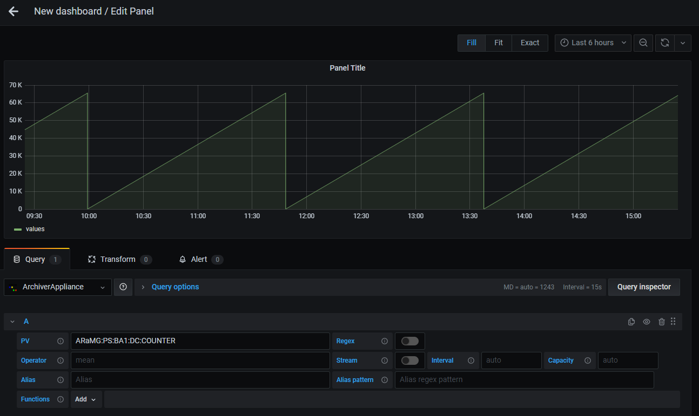
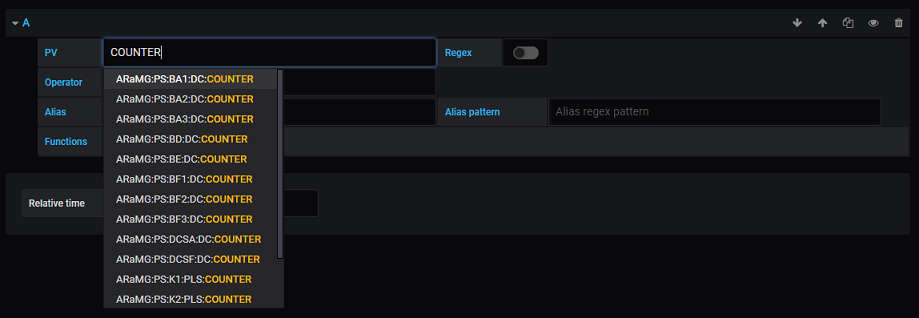
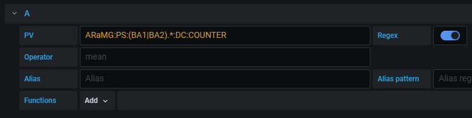
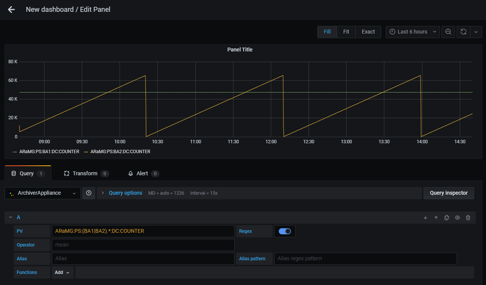
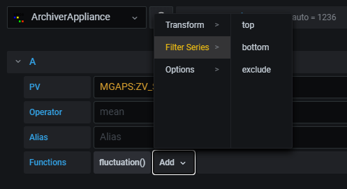
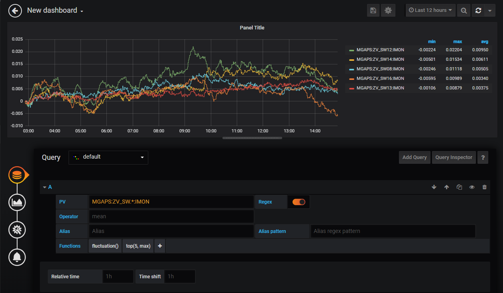

# Query Edit

## Overview


| Configuration | Description |
|---------------|-------------|
| **PV** | Set PV name to be visualized. It is allowed to set multiple PVs by using Regular Expressoins alternation pattern (e.g. `(PV:1|PV:2)`). |
| **Regex** | Enable/Disable Regex mode. Refer [Select Multiple PVs by Regex](#select-multiple-pvs-by-regex). |
| **Operator** | Controls processing of data during data retrieval (Default: `mean`). Refer [Archiver Appliance User Guide](https://slacmshankar.github.io/epicsarchiver_docs/userguide.html) about processing of data. Special operator `raw` and `last` are also available. `raw` allows to retrieve the data without processing. `last` allows to retrieve the last data in the specified time range. |
| **Stream** | Enable/Disable Stream mode. Stream allows to periodically update the data without refreshing the dashboard. The difference data from the last updated values is only retrieved.|
| **Interval** | Streaming interval in milliseconds. You can also use a number with unit. e.g. `1s`, `1m`, `1h`. The default is determined by a width of panel and time range. |
| **Capacity** | The stream data is stored in a circular buffer. Capacity determines the buffer size. The default is detemined by a initial data size. | 
| **Alias** | Set alias for legend. |
| **Alias pattern** | Set regular expressoin pattern to use PV name for legend alias. Refer [Legend Alias with Regex Pattern](#legend-alias-with-regex-pattern) |
| **Function** | Apply processing function for retrieved data. Refer [Apply Processing Functions](#apply-processing-functions) |

## PV Name Completion


Candidate PV names are shown during focussing on `PV` text input.

``` Note:: Maximum number of candidate names is **100**.
```

## Select Multiple PVs by Regex
You can select multiple PVs using Regular Expressoins.
To enable Regex mode, click `Regex` button next to `PV` text input.


The plugin supports only **wildcard pattern** and **alternation pattern**.

```eval_rst
.. Note:: Maximum number of PVs you can select on Regex mode is **100** in default.  :ref:`functions:maxNumPVs` function is available to change maximum number.
```

### Wildcard Pattern
Wildcard pattern (e.g. `.*`) is used to match any characters.
For example, `PV:.*` matches `PV:1`, `PV:2`, `PV:ABC:1`, `PV:ABC:2`. and `PV:EFG:1`.


Result of above query is shown below.


### Alternation Pattern
Alternation pattern (e.g. `(A|B|C)`) is used to OR matching.
For example, `PV:(ABC|EFG):.*` matches `PV:ABC:1`, `PV:ABC:2`, and `PV:EFG:1`.



Result of above query is shown below.



## Legend Alias with Regex Pattern
You can set legend alias using target PV name with `Alias pattern`.
`Alias pattern` is used to match PV name. Matched characters within parentheses can be used in
`Alias` text input like `$1`, `$2`, ..., `$n`.
To escape characters, two backslashes is required before the characters (e.g. `\\.`).


Result of above query is shown below.


## Apply Processing Functions
Functions are used to apply post processing to the data.
You can add, move and remove functions from `Functions` row.
Functions are categorized into some groups.
Select preffered functions from categoires.



Some functions require parameters. You can edit parameters after adding the function.

To see details of each function, refer [Functions](functions).




``` Note:: Functions are applied from left to right.
```

## Alerts
The plugin supports alerts. Alerts allow you to notify and identify problems.
You can create alerts on `Alert` tab.

See [Grafana Documentation](https://grafana.com/docs/grafana/latest/alerting/) for more information about alerts.


``` Note:: Go backend included in the plugin reteives archived data from Archiver Appliance to calculate alert condition.
```
